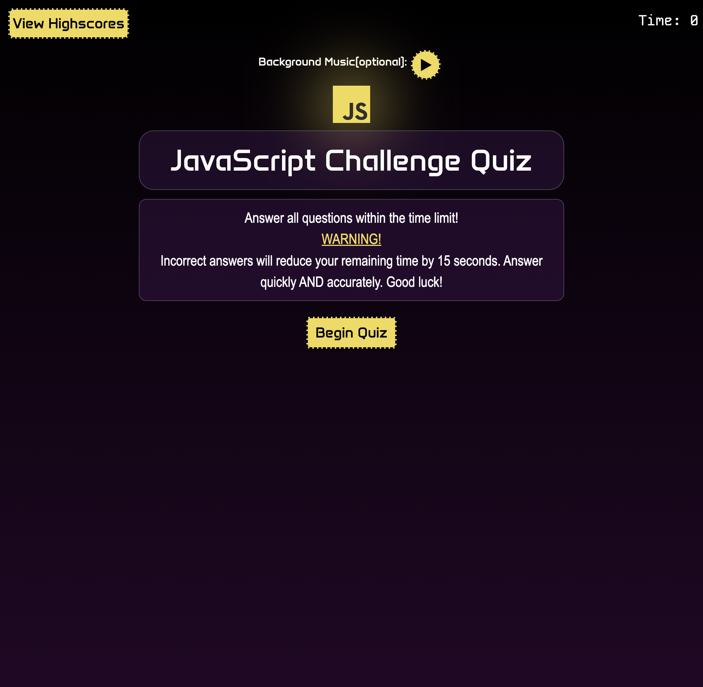
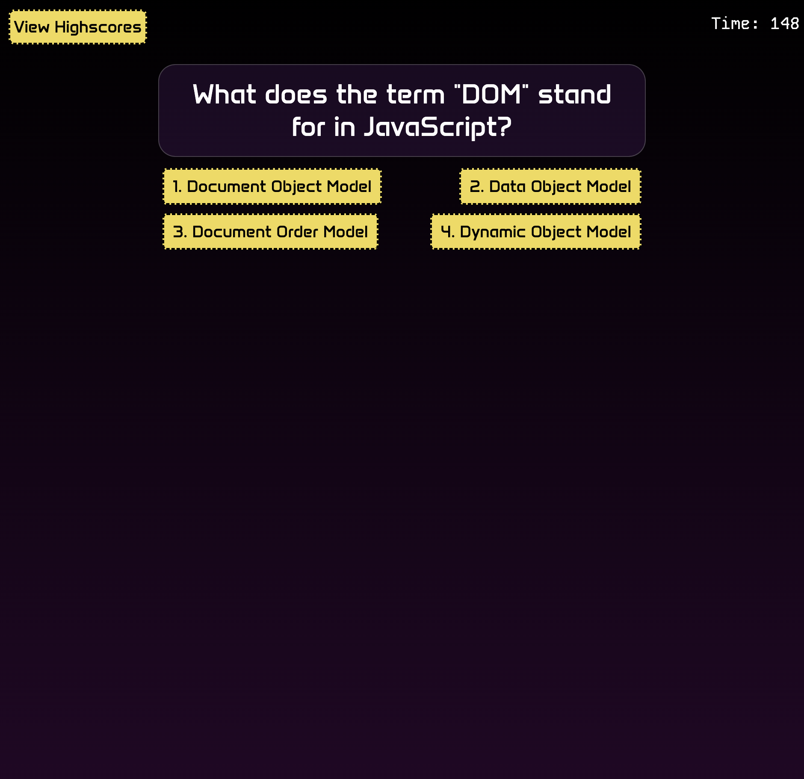
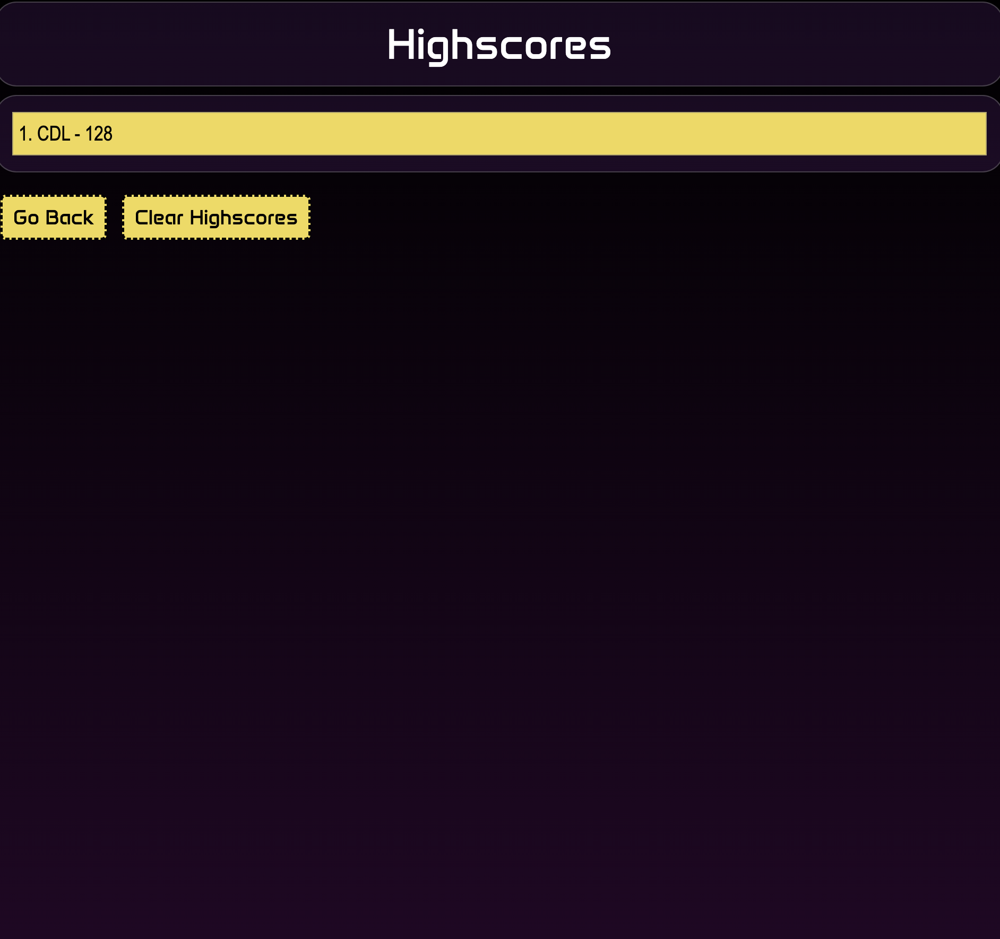

# JavaScript Challenge Quiz

## Description

This is a timed JavaScript Quiz to learn the basics of JavaScript. The time a user has left at the end is their score. Incorrect answers deduct 15 seconds from the player, so there is importance put on being quick and accurate. The highscores are also stored locally so players can revisit the site and try to beat their previous time. I created this quiz to practice my own JavaScript coding as well as review the topics covered in the quiz myself. This will help user review basic terminology, and the questions are arranged in an organized array, so they can be easily changed to review different material. 

## Table of Contents

- [Installation](#installation)
- [Usage](#usage)
- [Credits](#credits)
- [License](#license)

## Installation

This project was meant to be played in the browser here: https://chrisvulpine.github.io/javascript-quiz/

## Usage

The play simply needs to click the Begin Quiz button to start the quiz and timer. They can also click the Background Music button for some jams while they play, but this is optional. 

## Credits

For glow effect: https://www.codeinwp.com/snippets/css-glow-effect/#gref  

For easier css: bootstrap.com 

General Reference: w3schools.com 

JavaScript Reference: https://developer.mozilla.org/en-US/docs/Learn/JavaScript/Building_blocks/Events 

SFX: https://www.myinstants.com/en/index/us/ 

Flexbox Reference: https://forum.freecodecamp.org/t/css-flexbox-how-to-align-buttons-on-center/274433 

Animation in CSS: https://www.w3schools.com/css/css3_animations.asp  

Creating a Gradient Background: https://www.youtube.com/watch?v=YA8ZciJa64k&t=104s&ab_channel=BroCode 

## License

N/A

## Badges

## Thanks for Playing! 